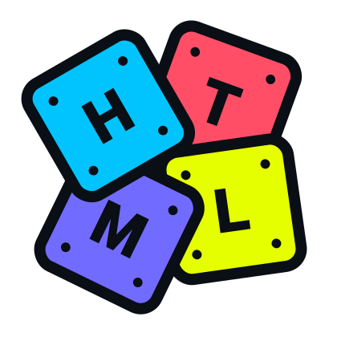

# HTML To Gutenberg

**Create custom Gutenberg blocks from the HTML templates you already have.**

**HTML To Gutenberg** is a developer tool that transforms HTML files into fully functional Gutenberg blocks for WordPress. With just a few intuitive attributes in your markup, it generates the full block structure — including `edit.js`, `render.php`, `block.json`, and `index.js`.

It’s designed for developers who value simplicity, speed, and control — without sacrificing the native block editor experience.

[Try it out in the Live Editor](https://html-to-gutenberg.com/live-editor)


## Quick start

**This project is built with ESM and requires Node.js version 20.0.0 or later.**

### 1. Scaffold an HTML To Gutenberg blocks plugin

```bash
cd wp-content/plugins
npx @wordpress/create-block --template html-to-gutenberg-template
```

This sets up everything you need — pre-configured to work with **HTML To Gutenberg**.

### 2. Start development

```bash
cd html-to-gutenberg-blocks # Your block plugin directory
npm run start
```

### 3. Edit the default block

Open `wp-content/plugins/html-to-gutenberg-blocks/src/block.html` and make changes to the default block.

**HTML To Gutenberg** will automatically convert it into a working Gutenberg block.

### 4. Add additional blocks

To create additional blocks, simply add new `.html` files in the src folder.

Each HTML file becomes its own block and is automatically processed by HTML To Gutenberg.

```txt
src/
├── block.html         # Default block (can be safely deleted)
├── hero.html          # Another custom block
├── testimonial.html   # Yet another one
```


> #### Note about blocks deletion
> When you delete an HTML file from src, its corresponding Gutenberg block is removed on the next build.
>
> However, depending on your setup, you may also need to manually delete the removed block folder inside the build/ directory to fully clean it up.

### 5. Activate your plugin

Enable your block in the WordPress admin and drop it into any page or post.

<details>
<summary>Can't see your plugin on the admin?</summary>


> Make sure you set a **title** when generating the plugin with `@wordpress/create-block`. If you don’t, the plugin may not appear in the WordPress plugins page.
>
> If you forgot to add one, open the root PHP file of your plugin and add a `Plugin Name` like so:
>
> ```php
> <?php
>
> /**
>  * Plugin Name:       HTML To Gutenberg Blocks <------ Add a name here
>  * Version:           0.1.0
>  * Requires at least: 6.7
>  * Requires PHP:      7.4
>  * Author:            The WordPress Contributors
>  * License:           GPL-2.0-or-later
>  * License URI:       https://www.gnu.org/licenses/gpl-2.0.html
>  * Text Domain:       textdomain
>  *
>  * @package CreateBlock
>  */
> ```

</details>

### 6. Build for production

```bash
npm run build
```

Bundles and minifies your blocks.


## Documentation

Visit the [official documentation](https://html-to-gutenberg.com).

### Quick links

- [Installation](https://html-to-gutenberg.com/getting-started/installation)
- [Registering blocks](https://html-to-gutenberg.com/getting-started/registering-blocks)
- [Creating a block](https://html-to-gutenberg.com/guides/creating-a-block)
- [Binding data to elements](https://html-to-gutenberg.com/guides/data-binding)
- [Using InnerBlocks](https://html-to-gutenberg.com/guides/innerblocks)
- [Adding InspectorControls](https://html-to-gutenberg.com/guides/inspector-controls)

## Example

Visit the [official documentation](https://html-to-gutenberg.com) to try this code in a live interactive editor.

#### block.html

```html
<section
  class="py-20 bg-blue-200"
  data-parent="custom/parent-block"
  data-editing-mode="contentOnly"
>
  <inspector-controls>
    <panel-body title="Settings">
      <select-control data-bind="postType" label="Post Type">
        <select-control-option value="posts">Posts</select-control-option>
        <select-control-option value="pages">Pages</select-control-option>
      </select-control>
    </panel-body>
  </inspector-controls>

  <div class="container">
    <div class="grid grid-cols-12 gap-4">
      <div class="col-span-12 md:col-span-6">
        <h2 class="text-2xl" data-bind="sectionTitle">
          Edit me inside the editor
        </h2>
        
      </div>

      <div class="col-span-12 md:col-span-6">
        <inner-blocks allowedBlocks="all" templateLock="all">
          <inner-block name="core/group">
            <inner-block name="core/heading" level="3"></inner-block>
            <inner-block name="core/paragraph">
              <block-attribute name="content">
                Lorem ipsum dolor sit amet consectetur.
              </block-attribute>
            </inner-block>
          </inner-block>
        </inner-blocks>
      </div>
    </div>
  </div>
</section>
```

#### block/edit.js

```jsx
import {
  useBlockProps,
  useBlockEditingMode,
  InnerBlocks,
  RichText,
  MediaUpload,
  InspectorControls,
} from "@wordpress/block-editor";
import { PanelBody, SelectControl } from "@wordpress/components";
import { Image } from "@10up/block-components/components/image";

export default ({ attributes, setAttributes }) => {
  useBlockEditingMode("contentOnly");

  return (
    <section {...useBlockProps({ className: "py-20 bg-blue-200" })}>
      <InspectorControls>
        <PanelBody title="Settings">
          <SelectControl
            label="Post Type"
            value={attributes.postType}
            onChange={(postType) => setAttributes({ postType })}
            options={[
              { label: "Posts", value: "posts" },
              { label: "Pages", value: "pages" },
            ]}
          ></SelectControl>
        </PanelBody>
      </InspectorControls>

      <div className="container">
        <div className="grid grid-cols-12 gap-4">
          <div className="col-span-12 md:col-span-6">
            <RichText
              className="text-2xl"
              tagName="h2"
              value={attributes.sectionTitle}
              onChange={(sectionTitle) => setAttributes({ sectionTitle })}
              placeholder="Section title"
            ></RichText>
            <MediaUpload
              value={attributes.sectionImage}
              onSelect={(image) => setAttributes({ sectionImage: image.id })}
              render={({ open }) => (
                <Image
                  style={{ cursor: "pointer", pointerEvents: "all" }}
                  onClick={open}
                  className="aspect-square object-cover"
                  id={attributes.sectionImage}
                  onSelect={(image) =>
                    setAttributes({ sectionImage: image.id })
                  }
                />
              )}
            ></MediaUpload>
          </div>

          <div className="col-span-12 md:col-span-6">
            <InnerBlocks
              template={[
                [
                  "core/group",
                  {},
                  [
                    ["core/heading", { level: 3 }],
                    [
                      "core/paragraph",
                      { content: "Lorem ipsum dolor sit amet consectetur." },
                    ],
                  ],
                ],
              ]}
              templateLock="all"
            ></InnerBlocks>
          </div>
        </div>
      </div>
    </section>
  );
};
```

#### block/render.php

```php
<?php

$sectionImage_id = $attributes['sectionImage'] ?? '';
$sectionImage = $sectionImage_id ? wp_get_attachment_image_src($sectionImage_id, 'full') : [''];
$sectionImage_src = $sectionImage[0] ?? '';
$sectionImage_srcset = $sectionImage_id ? wp_get_attachment_image_srcset($sectionImage_id, 'full') : '';
$sectionImage_sizes = $sectionImage_id ? wp_get_attachment_image_sizes($sectionImage_id, 'full') : '';
$sectionImage_alt = $sectionImage_id ? get_post_meta($sectionImage_id, '_wp_attachment_image_alt', true) : '';

?>

<section <?php echo get_block_wrapper_attributes(['class' => 'py-20 bg-blue-200']); ?>>
  <div class="container">
    <div class="grid grid-cols-12 gap-4">
      <div class="col-span-12 md:col-span-6">
        <h2 class="text-2xl"><?php echo wp_kses_post($attributes['sectionTitle'] ?? ''); ?></h2>
        " srcset="<?php echo esc_attr($sectionImage_srcset); ?>" sizes="<?php echo esc_attr($sectionImage_sizes); ?>" alt="<?php echo esc_attr($sectionImage_alt); ?>" />
      </div>
      <div class="col-span-12 md:col-span-6">
        <?php echo $content; ?>
      </div>
    </div>
  </div>
</section>
```

#### block/block.json

```json
{
  "name": "custom/block",
  "title": "Block",
  "textdomain": "block",
  "$schema": "https://schemas.wp.org/trunk/block.json",
  "apiVersion": 3,
  "version": "0.1.0",
  "category": "theme",
  "example": {},
  "parent": ["custom/parent-block"],
  "attributes": {
    "align": { "type": "string", "default": "full" },
    "sectionImage": { "type": "integer" },
    "postType": { "type": "string", "default": "posts" },
    "sectionTitle": { "type": "string", "default": "Edit me inside the editor" }
  },
  "supports": { "html": false, "align": ["full"] },
  "editorScript": "file:./index.js",
  "render": "file:./render.php"
}
```

#### block/index.js

```jsx
import { registerBlockType } from "@wordpress/blocks";
import { InnerBlocks } from "@wordpress/block-editor";

import Edit from "./edit.js";
import metadata from "./block.json";

registerBlockType(metadata.name, {
  edit: Edit,
  save: () => <InnerBlocks.Content />,
});
```
