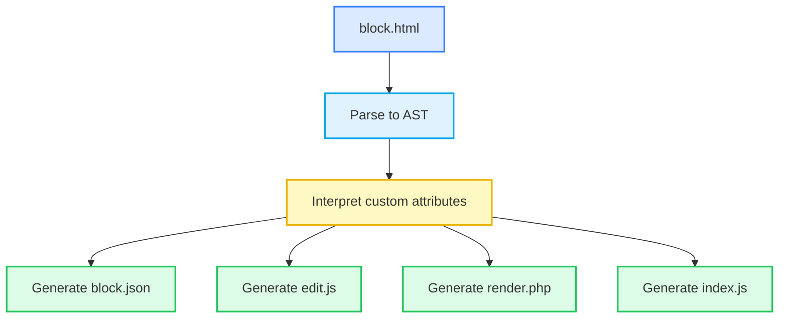

import LiveEditor from "@site/src/components/LiveEditor";


# HTML To Gutenberg

**Create custom Gutenberg blocks from the HTML templates you already have.**

**HTML To Gutenberg** is a tool that transforms a single html file into a fully functional Gutenberg block. With just a few intuitive attributes in your markup, it generates the full block structure — including `edit.js`, `render.php`, `block.json`, and `index.js`.

It’s designed for developers who value simplicity, speed, and control — without sacrificing the native block editor experience.


## Why HTML To Gutenberg?

If you’ve built Gutenberg blocks the traditional way, you’ve probably asked yourself:

- Why am I duplicating layout in both React and PHP?
- Why does a simple block need 4 different files?
- Why can’t I just write HTML and be done?

Now you can. **HTML To Gutenberg** gives you a radically simpler way to build blocks — while still compiling down to 100% standard Gutenberg code under the hood.

It works great whether you're a developer in quest of a better blocks developer experience, an agency building custom themes, or a product team maintaining a block library.

## Try it live

Type some HTML. Add attributes. Add InnerBlocks. Done. 🎉

<LiveEditor>
  ```
  <section class="py-20 bg-blue-200" data-parent="custom/parent-block" data-editing-mode="contentOnly">
    <div class="container">
      <div class="grid grid-cols-12 gap-4">
        <div class="col-span-12 md:col-span-6">
          <h2 class="text-2xl" data-attribute="section_title">I am editable – awesome, right?</h2>
          
        </div>

        <div class="col-span-12 md:col-span-6">
          <blocks allowedBlocks="all" templateLock="all">
            <block name="core/group">
              <block name="core/heading" level="3"></block>
              <block name="core/paragraph">
                <attribute name="content">
                  Lorem ipsum dolor sit amet consectetur.
                </attribute>
              </block>
            </block>
          </blocks>
        </div>
      </div>
    </div>

  </section>
  ```
</LiveEditor>

## Quick start

### 1. Scaffold your block

```bash
cd wp-content/plugins
npx @wordpress/create-block --template html-to-gutenberg-template
```

This sets up everything you need, pre-wired to use HTML To Gutenberg.

### 2. Start development

```bash
cd my-awesome-block # Your block plugin path
npm run start
```

### 3. Make changes to your block

Open `wp-content/plugins/my-awesome-block/src/block.html` and make changes to your block. Save the file, HTML To Gutenberg automatically converts it to native Gutenberg block.

### 4. Activate your plugin

Enable your block via WordPress admin and drop it into any page or post.

5. Build for production

```bash
npm run build
```

This bundles and minifies the block to makes it ready for production.

## Supported features

| Feature                     | Supported          |
| --------------------------- | ------------------ |
| Inline editable fields      | :white_check_mark: |
| InnerBlocks with templates  | :white_check_mark: |
| Server-side rendering (PHP) | :white_check_mark: |
| Editor rendering (JSX)      | :white_check_mark: |
| Block styles                | :white_check_mark: |
| Custom attributes           | :white_check_mark: |
| `block.json` metadata       | :white_check_mark: |

## How it works

Under the hood, **HTML To Gutenberg** builds an AST from your HTML file, then converts it to `JSX`, `JSON` and `PHP`.

Here’s what happens:

1. **Your HTML is parsed into an Abstract Syntax Tree (AST)**
   The tool analyzes your block’s structure turning your HTML into a tree of nodes it can manipulate intelligently.
2. **The AST is crawled to extract custom attributes and translate the markup**
   Attributes like `data-attribute`, `data-parent`, and `<blocks>` elements define how fields, templates, and InnerBlocks behave. These are translated into the appropriate Gutenberg APIs.
3. **Code is generated for every part of the block**
   From a single `block.html``, the tool outputs:
   - `block.json` (metadata + config)
   - `edit.js` (editor component)
   - `render.php` (frontend rendering)
   - `index.js` (block registration)
4. **It rebuilds your block automatically on save**
   During development, it watches for changes and regenerates output.



## Built for modern WordPress teams

If you’re tired of hacking together JSX, struggling with sidebar field UIs that offer a sub-optimal editing experience, or duplicating templates across PHP and JS, HTML To Gutenberg gives you a better way forward.

**Real blocks. Real fast.**
